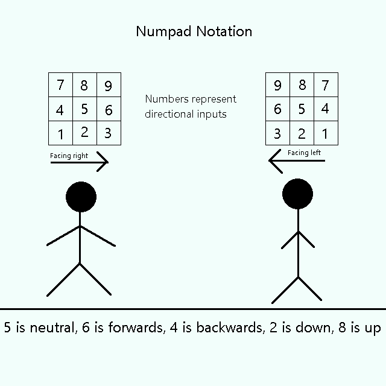
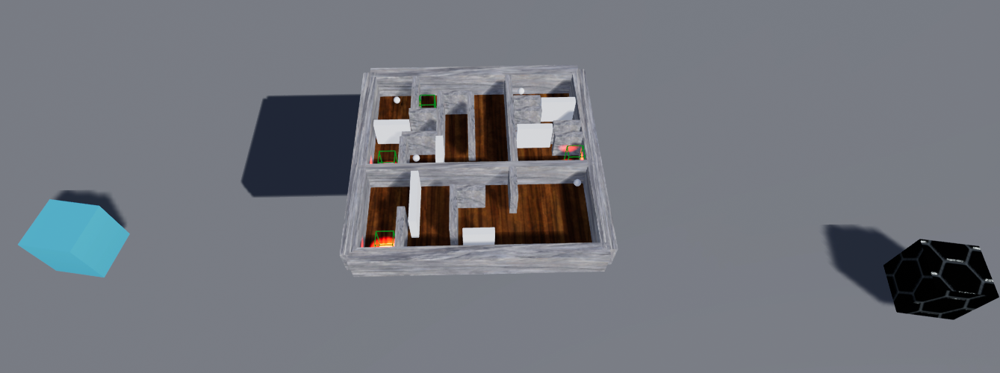
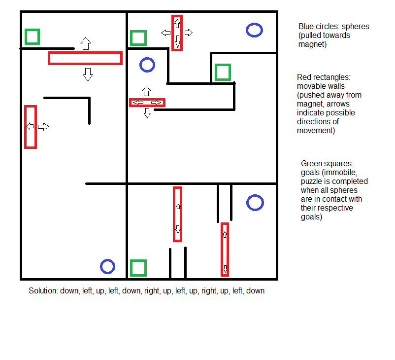
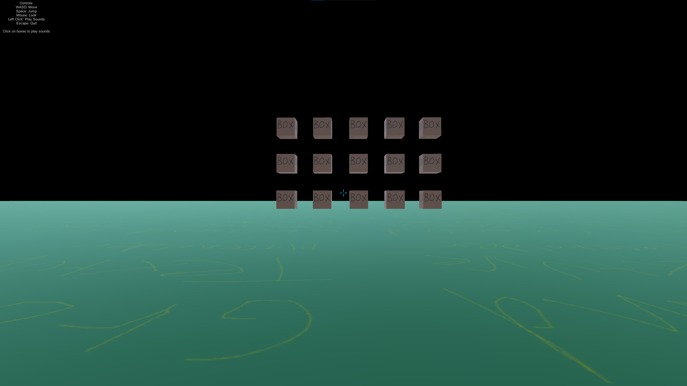
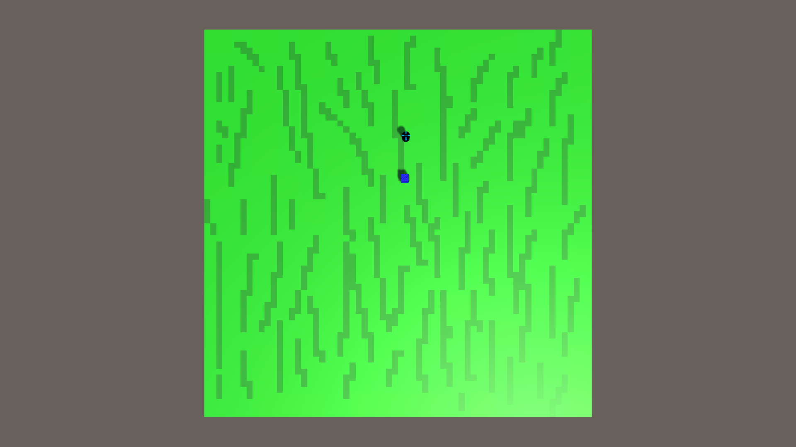

# Introduction
This portfolio is a showcase of various projects that I've worked on during my undergraduate coursework, internships, and free time.  For each project within this portfolio, I've included a description of the project's functionality, along with screenshots and/or diagrams to demonstrate or further explain each proejct.

## Project 1: Motion Input Parser

This project is a test of a C# algorithm for parsing sequences of 8-way directional inputs, as is common in 2D fighting games.  In most 2D fighting games, special moves are typically performed with motion inputs, which are a series of directional inputs followed by a button press.  Because this input parser is intended to be implemented in a 2D fighting game, the following assumptions are made based on standard 2D fighting game mechanics:

1. The game runs at 60 frames per second.
2. Inputs are polled once per frame.
3. On any given frame, the directional input can be neutral or any of 8 directions (4 cardinals, 4 diagonals).

In order to meet the requirements for use in a 2D fighting game, this input parser was made with the following requirements:

1. The parser must be able to support an arbitrary number of motion inputs, so that there is no hard limit on the number of special moves that a character may have.
2. Sequences must be ordered by priority such that certain motion inputs are prioritized over others in the event that a sequence of inputs can be interpreted as multiple valid motion inputs.
3. The parser must be able to support arbitrarily complex motion inputs, meaning that there is no limit on the number of directions that a single motion input can contain.
4. Each motion input's complexity must be completely independent from all other motion inputs' complexity.
5. To provide a degree of leniency instead of demanding frame-perfect inputs, the parser must have a buffer that allows for multiple frames to elapse between each directional input in a motion input.
6. Motion inputs must be represented using numpad notation (a system for representing directional inputs as numbers), which is the de facto standard for representing directional inputs in 2D fighting games.  In a real-world implementation of this algorithm, the input reader would convert directional inputs to the equivalent in numpad notation, so this algorithm represents directional inputs as integers from 1 to 9.

Image: A diagram depicting numpad notation

This project outputs text to the console, representing the motion input that would be detected if a player were to input certain sequences of directions.

## Project 2: VR Magnet Puzzle

This project is a VR puzzle created in Unreal Engine 4 using Blueprints.  The player's goal is to use a handheld magnet to move objects within a maze into specific positions.  This puzzle was created during a VR game development internship in which it serves as one of multiple puzzles that the player must solve in order to complete a level in a VR adventure game. There are four main components to this puzzle:

1. A handheld magnet that the player can manipulate in VR
2. Spheres that are pulled towards the magnet
3. Movable walls that are pushed away from the magnet
4. Goals that activate when a sphere is touching them

All spheres and movable walls are contained within a maze and must be moved using the handheld magnet.  The maze itself is split into multiple sections, each of which contains one sphere, one goal, and one or more movable walls.  All movable objects within the maze are simultaneously affected by the magnet, so the player cannot move an object without also moving other objects.  The objective is to use the magnet to manipulate the spheres and movable walls such that all spheres are touching their respective goals simultaneously.  In order to solve the puzzle, the player must make use of the maze's geometry and the movable walls to guide the spheres to the goals.

Image: A screenshot of the puzzle in Unreal Engine

Image: An image depicting the layout of the puzzle from a top-down perspective, along with the puzzle's solution

In this demo, there are two magnets, represented by cubes.  The black cube functions as described above (pulls spheres, pushes walls), while the blue cube has the opposite effect (pushes spheres, pulls walls).  In the final implementation of this puzzle in the VR adventure game, the handheld magnet uses the behavior of the black cube.

## Project 3: First-Person Demo

This project is a demo of first-person movement, hit detection, UI, and audio playback in Unity.  The demo consists of an environment containing the following elements:

1. A first-person character controller
2. Multiple boxes that play a sound when clicked on

The first-person controls follow standard conventions for first-person movement:
WASD: Move/Strafe
Left Shift: Walk (reduce movement speed while held)
Space: Jump
Mouse: Look/Turn

The UI elements of this demo are a text box in the top-left corner listing the controls and a crosshair in the center of the screen to indicate where the camera is looking.

Each box plays a sound when the left mouse button is clicked while aiming at that box.  In this demo, the boxes all play differently-pitched versions of the same sound, but a different sound can be assigned to each box in the editor.

Image: A screenshot of this project

## Project 4: Autonomous Machine Learning Agent Training

This project is a machine learning demo in which an autonomous agent attempts to navigate towards a target within an area without exiting the area.  The agent can accelerate in four cardinal directions, but it cannot otherwise influence its position, meaning it must accelerate and decelerate along two axes in order to navigate towards the goal.  Whenever the agent successfully reaches the target or fails by exiting the area, the target is moved to a random location within the area.  In this project, the agent was trained through reinforcement learning by rewarding successful navigation to the target and applying a penalty when the agent exits the area.

The purpose of this project was to create a simple game with conditions for success and failure, then attempt to train an autonomous agent to play the game by rewarding success and penalizing failure.

Image: A screenshot of this project.  The cube represents the agent, while the cylinder represents the target.

